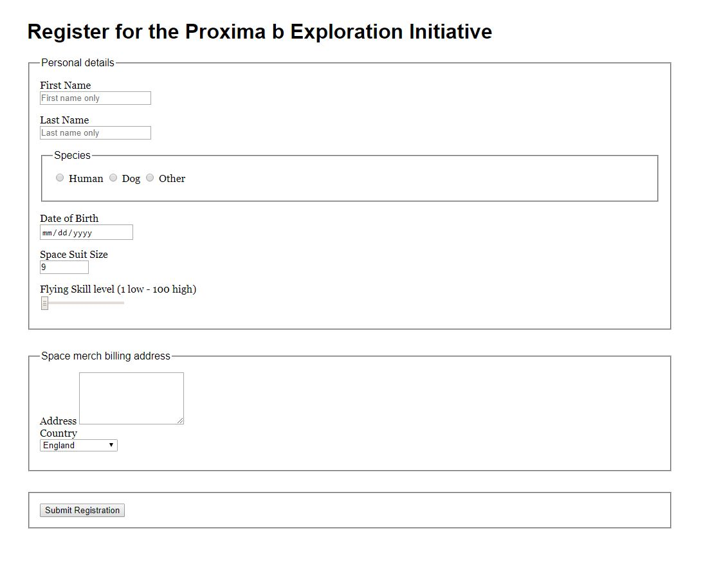
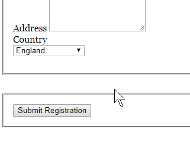
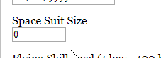

# HTML Forms

Create the form shown in the design below

## Design

## Requirements

Create an HTML page that has **all the types of inputs** shown in the design.

### Bonus points!

Try to achieve a design-to-HTML conversion as close to the design as possible.

## Special Types

## Help

Whenever you need that little nudge in the right direction remember that I am available at the email provided in class :)