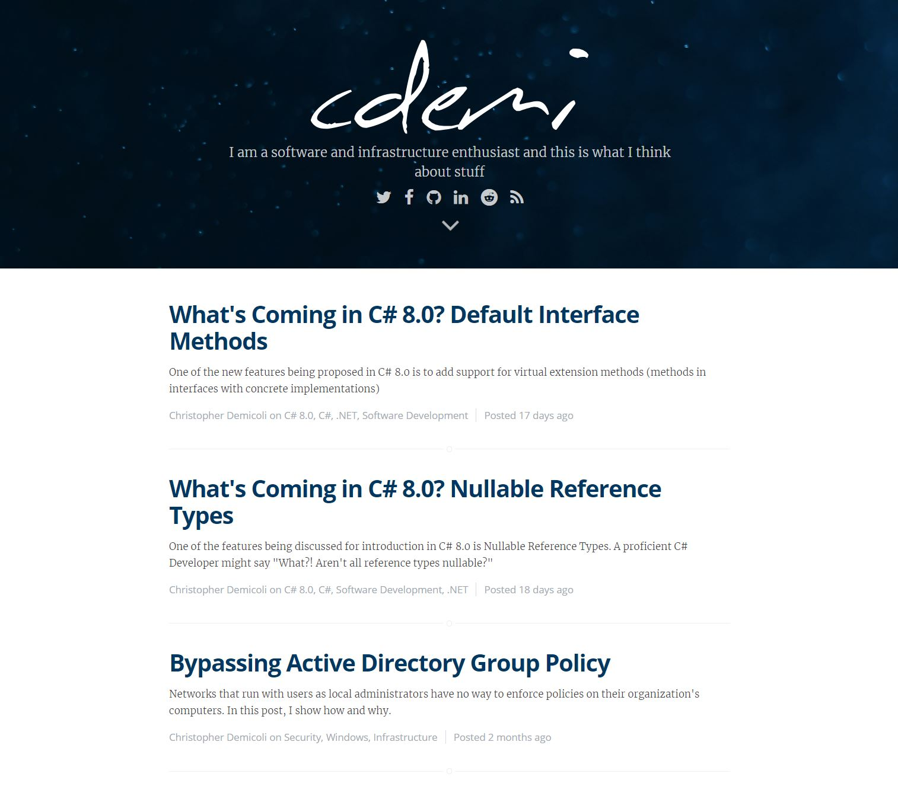

# HTML5 Semantic Tags

Create the HTML structure for the following blog design using HTML5 sematic tags

## What to look out for

Make sure that the HTML structure follow these specifications

* Use HTML5 semantic tags where possible
* Make sure you include CSS to align the blog in the middle of the page (940px)

## Resources

Resources are all included within the `imgs` folder

## Help

Whenever you need that little nudge in the right direction remember that I am available at the email provided in class :)