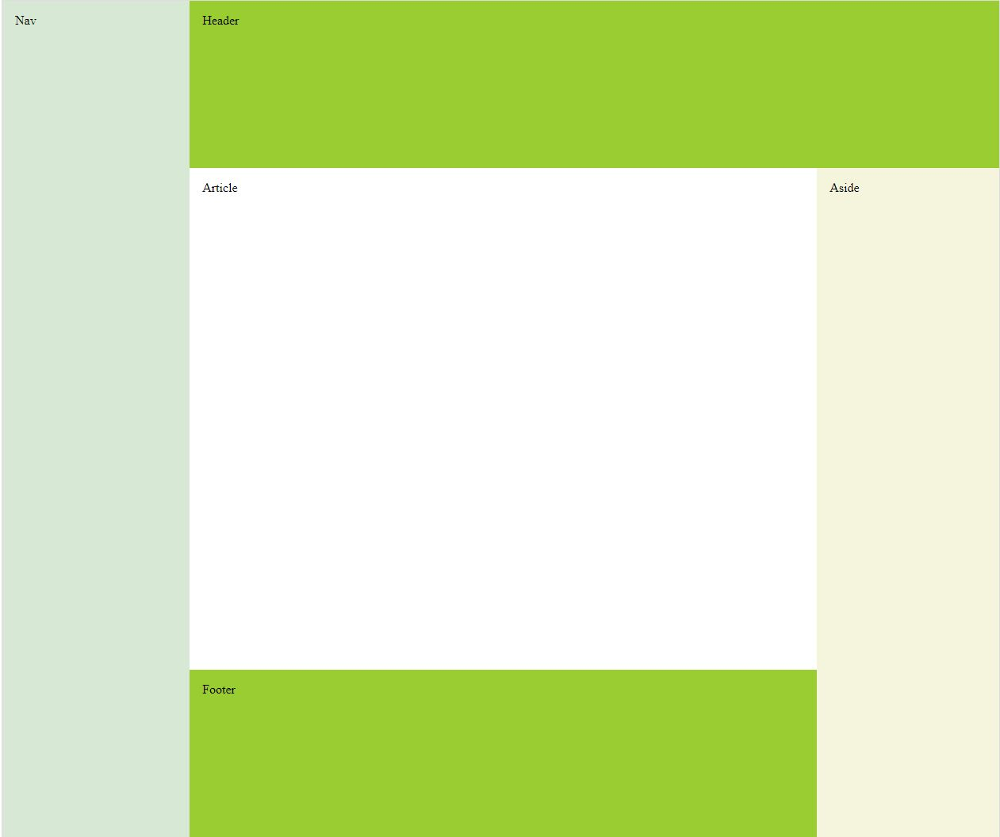
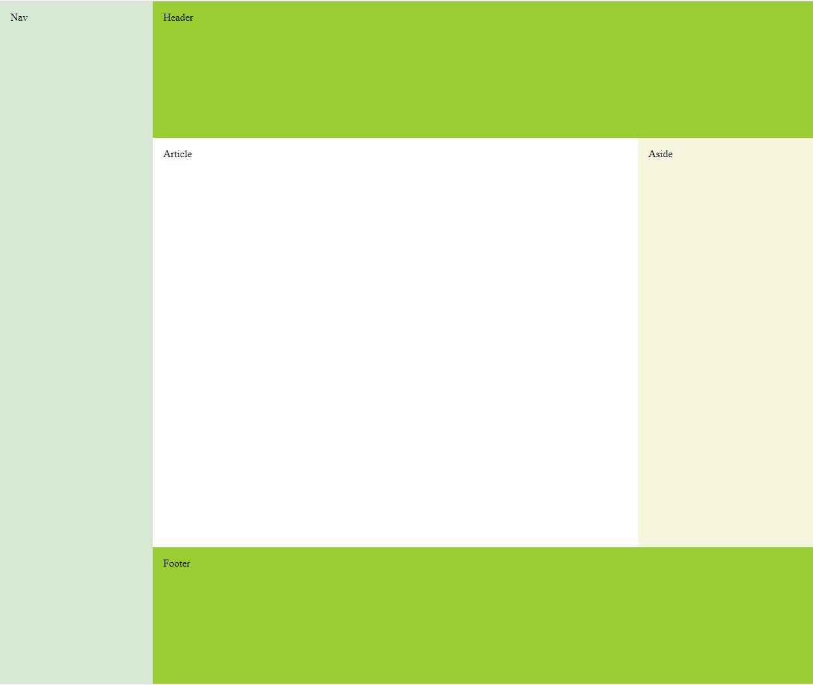

# CSS3 Flexbox Layouts

Create the following layouts using the Flexbox Model

## Design 1

## Design 2

## Help

Whenever you need that little nudge in the right direction remember that I am available at the email provided in class :)