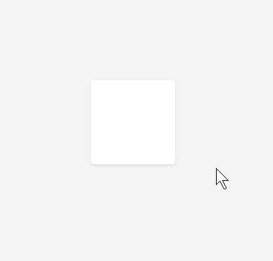

# CSS3 Box Shadow & Transitions

Smoothly transition this bow into the state depicted below it __on hover__

## Box Initial State

## Box Hover State

## What to look out for

* To target the hover state of the element we can use the hover selector

## Demo

## Help

Whenever you need that little nudge in the right direction remember that I am available at the email provided in class :)