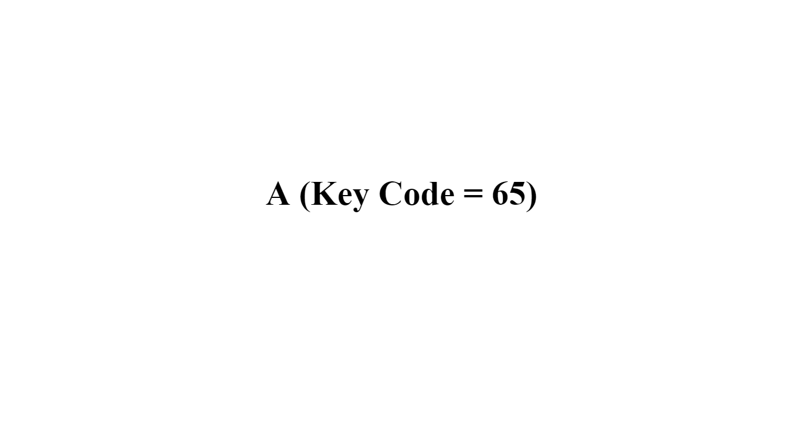

# Javascript Key Display

Create an HTML page that displays the keys pressed (and their respective key codes) center aligned vertically and horizontally on the viewport

## Help

Whenever you need that little nudge in the right direction remember that I am available at the email provided in class :)